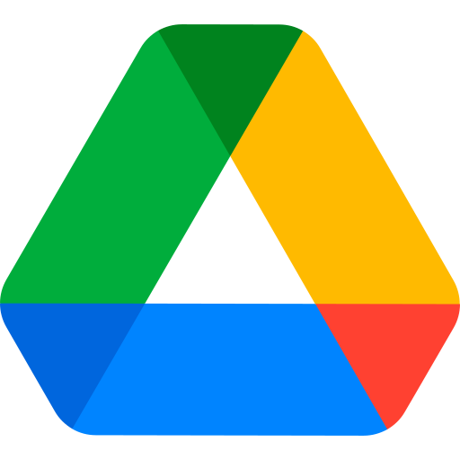
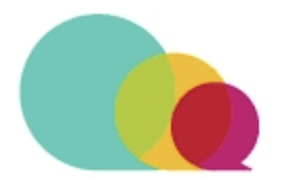

# HERRAMIENTAS

 

### Survey Tools

|----|----|
|----|----|
|    [Google Forms](https://www.google.com/forms/about/) |    |
   - 
   - [Typeform](https://www.typeform.com/)

3. **SurveyMonkey**
   - 
   - [SurveyMonkey](https://www.surveymonkey.com/)

4. **Jotform**
   - 
   - [Jotform](https://www.jotform.com/)

5. **SurveyLegend**
   - 
   - [SurveyLegend](https://www.surveylegend.com/)

### A/B Testing Tools

6. **VWO**
   - 
   - [VWO](https://vwo.com/)

7. **Unbounce**
   - 
   - [Unbounce](https://unbounce.com/)

8. **Omniconvert**
   - 
   - [Omniconvert](https://www.omniconvert.com/)

9. **Crazy Egg**
   - 
   - [Crazy Egg](https://www.crazyegg.com/)

10. **Kameleoon**
    - 
    - [Kameleoon](https://www.kameleoon.com/)

### Card Sorting Tools

11. **UXtweak**
    - 
    - [UXtweak](https://www.uxtweak.com/)

12. **UserZoom**
    - 
    - [UserZoom](https://www.userzoom.com/)

13. **Kardsort**
    - 
    - [Kardsort](https://www.kardsort.com/)

14. **Useberry**
    - 
    - [Useberry](https://www.useberry.com/)

15. **Card-Sorting**
    - 
    - [Card-Sorting](https://www.card-sorting.com/)

### Heat Mapping Tools

16. **Hotjar**
    - 
    - [Hotjar](https://www.hotjar.com/)

17. **MouseFlow**
    - 
    - [MouseFlow](https://mouseflow.com/)

18. **Smartlook**
    - 
    - [Smartlook](https://www.smartlook.com/)

19. **Fullstory**
    - 
    - [Fullstory](https://www.fullstory.com/)

20. **Livesession**
    - 
    - [Livesession](https://livesession.io/)

### User Interview Tools

21. **Notably.ai**
    - 
    - [Notably.ai](https://www.notably.ai/)

22. **Looppanel**
    - 
    - [Looppanel](https://looppanel.com/)

23. **Grain.co**
    - 
    - [Grain.co](https://grain.co/)

24. **Otter.ai**
    - 
    - [Otter.ai](https://otter.ai/)

25. **Maze AI**
    - 
    - [Maze AI](https://maze.co/)

### Usability Testing Tools

26. **Maze**
    - 
    - [Maze](https://maze.co/)

27. **Lookback**
    - 
    - [Lookback](https://lookback.io/)

28. **Userpeek**
    - 
    - [Userpeek](https://userpeek.com/)

29. **UserTesting**
    - 
    - [UserTesting](https://www.usertesting.com/)

30. **Userbrain**
    - 
    - [Userbrain](https://www.userbrain.net/)

### Market Research Tools

31. **Statistica**
    - 
    - [Statistica](https://statistica.io/)

32. **Glimpse**
    - 
    - [Glimpse](https://meetglimpse.com/)

33. **Tableau**
    - 
    - [Tableau](https://www.tableau.com/)

34. **Paperform**
    - 
    - [Paperform](https://paperform.co/)

35. **Loop11**
    - 
    - [Loop11](https://www.loop11.com/)

### Research Analysis Tools

36. **Ask Viable**
    - 
    - [Ask Viable](https://askviable.com/)

37. **Thematic**
    - 
    - [Thematic](https://getthematic.com/)

38. **Lexalytics**
    - 
    - [Lexalytics](https://www.lexalytics.com/)

39. **MonkeyLearn**
    - 
    - [MonkeyLearn](https://monkeylearn.com/)

40. **HeyMarvin**
    - 
    - [HeyMarvin](https://heymarvin.com/)

Feel free to use this list as a reference for the tools you need for your UX research.

| Nº | Descripción | Enlace |
| ------ | ------ | ----------------- |
| 1 |  Libro UX  | https://books.dokozero.design/es/contents/uxui-design-resources/tools/ |
|  - |  - |
| 2 |  Podcasts  | https://www.uifrommars.com/podcasts-diseno-uiux/ |
| - | - |
| 3.1 |  Los distintos roles dentro del User Experience (UX)  | https://medium.com/laboratoria/los-distintos-roles-dentro-del-user-experience-ux-601706d578aa |
| 3.2 |  Roles UX | https://uxdesign.cc/understanding-ux-roles-23032b94710d |
| 3.3 |  Diseño de Interacción o UX/UI | https://eduardoaguayo.cl/blog/ixd-o-ux-ui |
| 3.4 | Roles en TI | https://itechindia.co/us/blog/why-are-both-a-ux-designer-and-software-engineer-needed-for-app-build-2/ |
| - | - |

   

| Nº | Descripción | Enlace |
| ------ | ------ | ----------------- |
|  | Google Drive | https://drive.google.com |
| - |  |
|  | Figma | https://www.figma.com/ |
| - |  |
|  | Miro | https://miro.com/ |
|  | Design Thinking | https://designthinking.es/ |
| - |  |
|  | Codeshare | https://codeshare.io/ |
|  | CodePen | https://codepen.io/ |
|  | Visual Estudio Code | https://code.visualstudio.com/ |
|  | Github | https://github.com/ |
